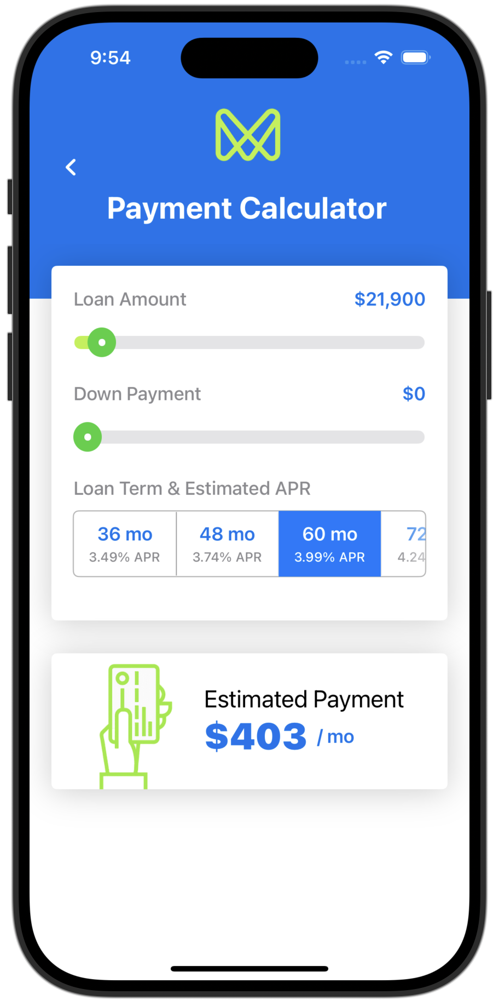

# Payment Calculator - SwiftUI
2024-11-14

Create a Mockup of a Payment Calculator and calculate the PMT value for a loan amount.

Credit: Sarah Kinney <https://dribbble.com/shots/5273790-Payment-Calculator-Daily-UI-004>

## Custom Components

* Custom Navigation Bar
* CustomSlider
* Term Selector (Horizontal selection)

## Topics

* Navigation ToolbarItem and Background Color
* CustomSlider
* SliderControl for PaymentCell
* Data Model
* Loan Card
* Estimated Payment
* Estimated Payment Calculations (PMT)
* Refactor

## PMT

Calculates the periodic payment loan amount for each month similar to the Excel function.

	PMT function is P = (Pv*R) / (1 - (1 + R)^(-n))

	P = Monthly Payment
	Pv = Present Value (starting value of the loan)
	APR = Annual Percentage Rate
	R = Periodic Interest Rate = APR/number of interest periods per year
	n = Total number of interest periods (interest periods per year * number of years)

## Resources

* <https://superuser.com/questions/871404/what-would-be-the-the-mathematical-equivalent-of-this-excel-formula-pmt>
* <https://www.calculator.net/payment-calculator.html?ctype=fixterm&cloanamount=21%2C900&cloanterm=5&cmonthlypay=2%2C000&cinterestrate=3.99&printit=0&x=Calculate#result>
