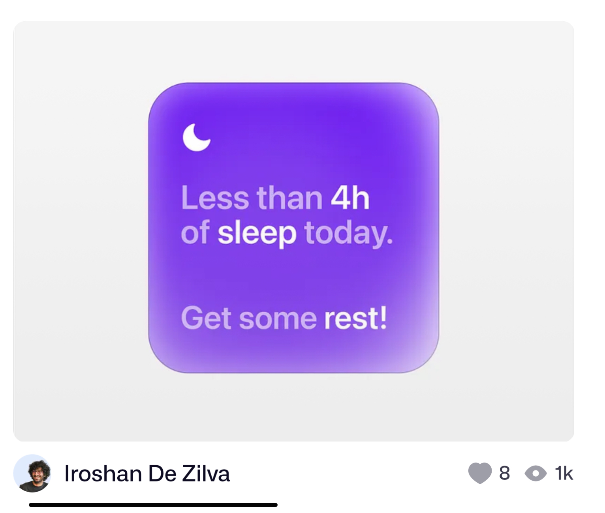

# Sleep Tracker iOS Widget - SwiftUI

This demo project shows how to create a Sleep Tracker iOS Widget with SwiftUI.

You will learn how to do text highlighting using the AttributedString and prepare for localization with a ViewModel object.

