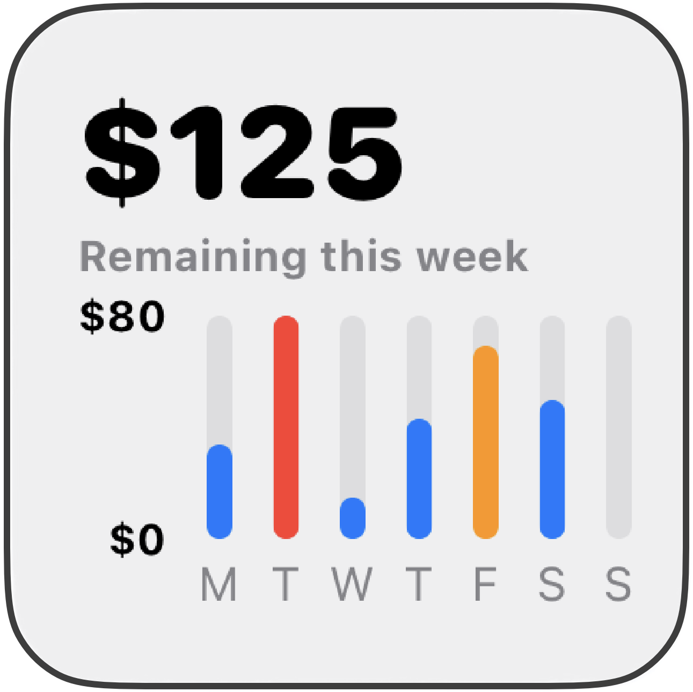

# 2025-06-07 Budget Widget (Swift Charts)

Jumpstart Swift Charts and SwiftUI in this 45-minute design challenge. Learn how to visualize budgets easily Charts. You'll discover how to design your View Model, create the chart, and customize the design.

[Watch the Swift Charts - Demo Video](https://youtu.be/xgVSmJH2l6o)

Learn how to:

* Customize a bar chart
* Hide or show graphing lines
* Stylize graph labels
* Format Dates for graphing
* Create ViewModels

