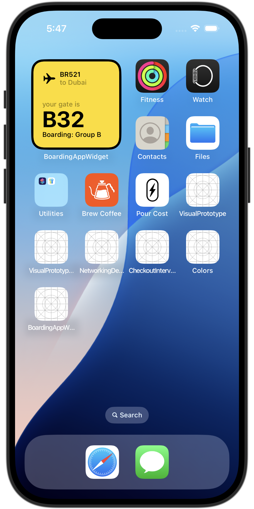
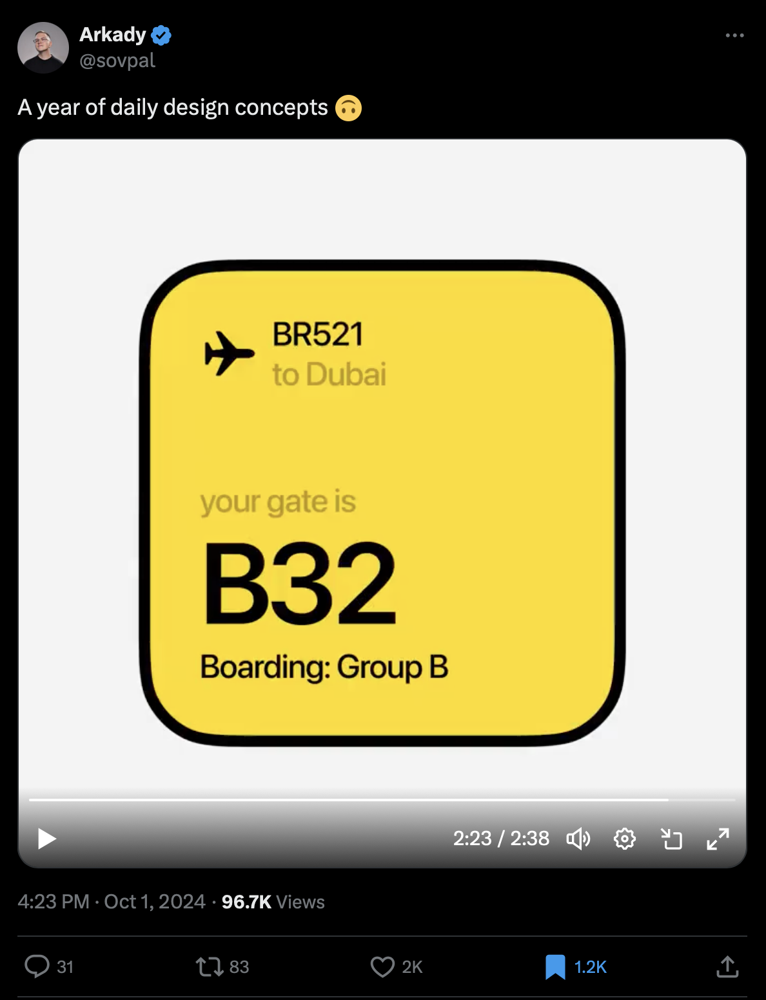

# Boarding App Widget for iOS - Daily Design Concept
2024-10-14

A short SwiftUI tutorial to implement the UI for a boarding app for flights.



Based on Arkady's design mockup for a Dubai flight

<https://x.com/sovpal/status/1841212238268358720>




## Match Existing Shapes for the Outline as a Widget

```swift
.containerBackground(for: .widget) {
	Color.black

	ContainerRelativeShape()
		.inset(by: 4)
		.fill(Color.yellow)
}
```

## References

* <https://useyourloaf.com/blog/swiftui-container-relative-shape/>