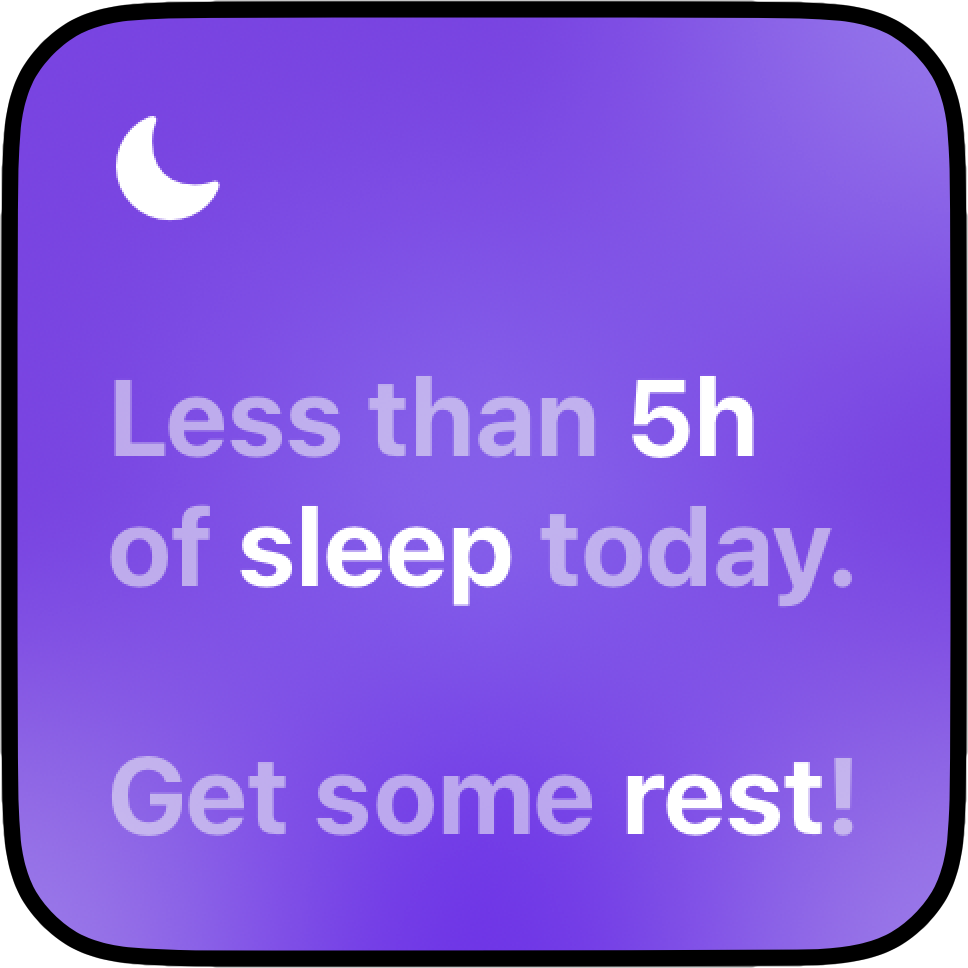
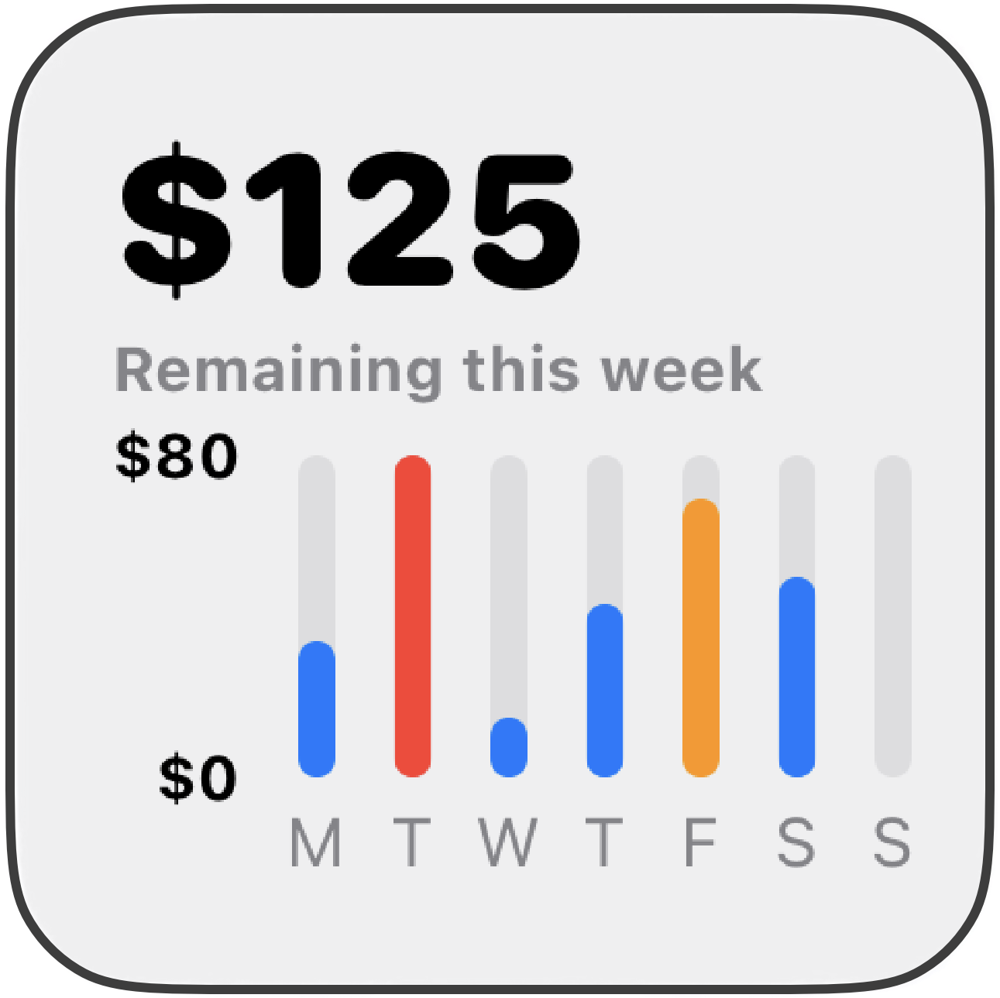

# SwiftUI Tutorials 2025
Paul Solt • Paul@SuperEasyApps.com

1. [SwiftUI Forms from UIKit](Tutorials/1_Form_UI/README.md)
2. [SwiftUI Forms - Sections](Tutorials/2_Form_UI_Sections/README.md)
3. [macOS - NSPanel Full Screen Notification](Tutorials/3_Mac_NSPanel_FullScreen_Notification/README.md)
4. [macOS - UI Test SwiftUI and AppKit](Tutorials/4_Mac_UI_Testing/README.md)
5. [SwiftUI Login Page - Observation](Tutorials/5_SwiftUI_Observation_LogInPage/README.md)
6. [SwiftUI Login Page Polish - TextField Customization](Tutorials/6_SwiftUI_LogInPage_Customized)
7. [SwiftUI Login Page Refactored Views](Tutorials/7_SwiftUI_LogInPage_Refactored/README.md)
8. SwiftData
9. [Boarding App Widget](Tutorials/9_BoardingAppWidget/README.md)
10. [Swift Testing](Tutorials/10_SwiftTesting/README.md)
11. [Payment Calculator - SwiftUI Design](Tutorials/11_PaymentCalculator/README.md)
	1. Custom Nav Bar
12. [CustomSlider - UISlider for SwiftUI](Tutorials/12_CustomSlider/README.md)
13. [CustomSelector - Multiline Horizontal Segmented Control](Tutorials/13_CustomSelector/README.md)
14. [How to Use Text and fixedSize](Tutorials/14_Text_fixedSize/README.md)
15. [How to use Padding in SwiftUI](Tutorials/15_Padding/README.md)
16. [Objective-C Swift Package Manager (SPM)](Tutorials/16_Swift_Package_Manager/README.md)
17. [Sleep Tracker Widget - SwiftUI Design Challenge](Tutorials/17_SleepWidget/README.md) [(👉 YouTube)](https://www.youtube.com/watch?v=B2Wswm8v6UQ)

	

18. [Localizations - Sleep Tracker Widget + RocketSim](Tutorials/18_Widget_Localizations/README.md)  [(👉 YouTube)](https://youtu.be/1piGNwdx9mA?si=ULpW5g5GCg5F4Nar)
19. [Swift Charts - Budget Widget](Tutorials/19_ChartsWidget) [(👉YouTube)](https://youtu.be/xgVSmJH2l6o)

	

