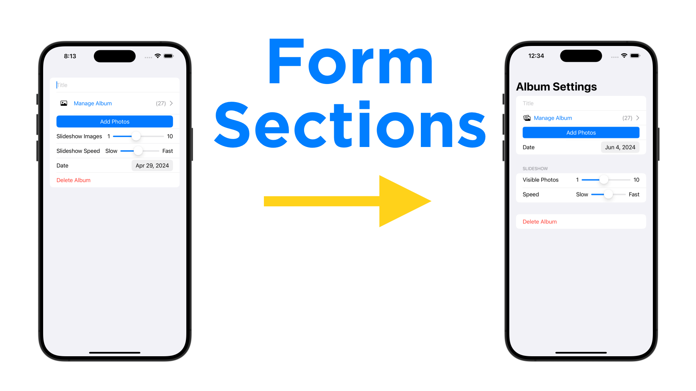

# SwiftUI Form Sections
2024-06-04



1. `BorderedProminentButtonStyle()` button style to fix button tap animation (prevents row selection).

	```swift
	Button(action: {
	    print("Add Photos Pressed")
	}, label: {
	    Text("Add Photos")
	        .foregroundStyle(.white)
	        .frame(maxWidth: .infinity)
	})
	.buttonStyle(BorderedProminentButtonStyle())
	```

2. `NavigationStack` and `.navigationTitle()` to show "Album Settings" at top


3. Section to separate destructive button
4. Geometry reader to do percentage based layouts to align the slider widths
5. Section to group sliders and update slider label names (section header: Slideshow)
